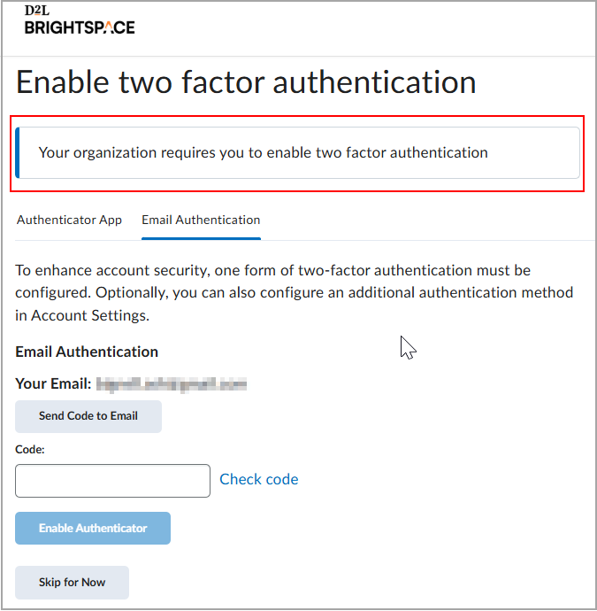
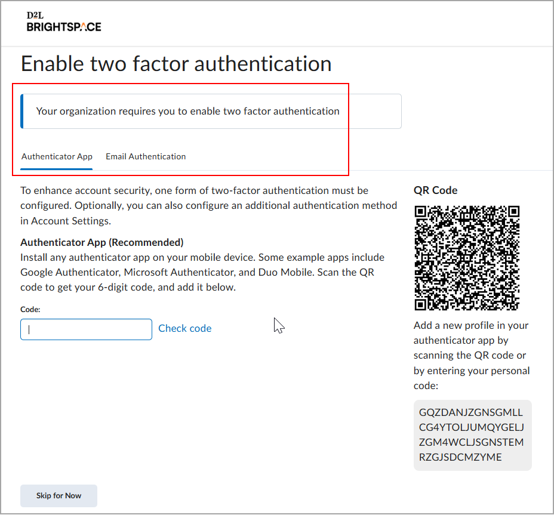
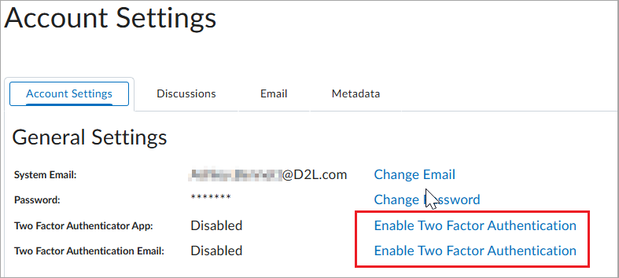

# Student documentation (K-12)

This page preserves the source surface more literally instead of reducing it to selected demo summaries. It includes the full source topic index and the full *Log In to Brightspace* article content with screenshots.

## Full topic index from the source page

- [Communicate](https://community.d2l.com/brightspace/kb/categories/456-communicate)
- [Get started](https://community.d2l.com/brightspace/kb/categories/448-get-started)
- [Get started with Portfolio](https://community.d2l.com/brightspace/kb/categories/1494-get-started-with-portfolio)
- [Student Documentation (K12)](https://community.d2l.com/brightspace/kb/categories/311-student-documentation-k12)
- [Brightspace ePortfolio](https://community.d2l.com/brightspace/kb/categories/457-brightspace-eportfolio)
- [Collect and manage evidence](https://community.d2l.com/brightspace/kb/categories/1495-collect-and-manage-evidence)
- [Course Orientation](https://community.d2l.com/brightspace/kb/categories/449-course-orientation)
- [Course accessibility](https://community.d2l.com/brightspace/kb/categories/454-course-accessibility)
- [Create and manage audio-video content with Media Library](https://community.d2l.com/brightspace/kb/categories/2797-create-and-manage-audio-video-content-with-media-library)
- [Interact and Engage with Peers](https://community.d2l.com/brightspace/kb/categories/450-interact-and-engage-with-peers)
- [Log In to Brightspace](https://community.d2l.com/brightspace/kb/articles/19145-log-in-to-brightspace)
- [Overview of tools](https://community.d2l.com/brightspace/kb/categories/455-overview-of-tools)
- [Access and Complete Course Activities](https://community.d2l.com/brightspace/kb/categories/451-access-and-complete-course-activities)
- [Browser support](https://community.d2l.com/brightspace/kb/articles/34434-browser-support)
- [Share information using the Blog tool](https://community.d2l.com/brightspace/kb/categories/459-share-information-using-the-blog-tool)
- [Change personal settings in Brightspace](https://community.d2l.com/brightspace/kb/articles/18036-change-personal-settings-in-brightspace)
- [Review Evaluation and Monitor Course Progress](https://community.d2l.com/brightspace/kb/categories/452-review-evaluation-and-monitor-course-progress)
- [Sharing with Brightspace ePortfolio](https://community.d2l.com/brightspace/kb/categories/461-sharing-with-brightspace-eportfolio)
- [Brightspace Parent and Guardian](https://community.d2l.com/brightspace/kb/categories/453-brightspace-parent-and-guardian)
- [Navigate Brightspace and find your course](https://community.d2l.com/brightspace/kb/articles/18048-navigate-brightspace-and-find-your-course)
- [Brightspace Portfolio](https://community.d2l.com/brightspace/kb/categories/1493-brightspace-portfolio)
- [Brightspace Pulse app](https://community.d2l.com/brightspace/kb/categories/460-brightspace-pulse-app)
- [Course homepage](https://community.d2l.com/brightspace/kb/articles/18056-course-homepage)
- [Access course content using the ReadSpeaker docReader integration](https://community.d2l.com/brightspace/kb/articles/1613-access-course-content-using-the-readspeaker-docreader-integration)
- [Use the Accessibility Checker on HTML-authored content](https://community.d2l.com/brightspace/kb/articles/1616-use-the-accessibility-checker-on-html-authored-content)
- [Use Anthology Ally (previously Blackboard Ally) to view alternative accessible formats of content](https://community.d2l.com/brightspace/kb/articles/1679-use-anthology-ally-previously-blackboard-ally-to-view-alternative-accessible-formats-of-content)
- [Video Note Automatic Captioning](https://community.d2l.com/brightspace/kb/articles/1619-video-note-automatic-captioning)
- [Awards](https://community.d2l.com/brightspace/kb/articles/22378-awards)
- [Content experiences](https://community.d2l.com/brightspace/kb/articles/18057-content-experiences)
- [Announcements](https://community.d2l.com/brightspace/kb/articles/18038-announcements)
- [Quizzes](https://community.d2l.com/brightspace/kb/articles/18061-quizzes)
- [Assignments](https://community.d2l.com/brightspace/kb/articles/18040-assignments)
- [Discussions](https://community.d2l.com/brightspace/kb/articles/18065-discussions)
- [Grades](https://community.d2l.com/brightspace/kb/articles/18039-grades)
- [Class Progress](https://community.d2l.com/brightspace/kb/articles/4898-class-progress)
- [Media Library](https://community.d2l.com/brightspace/kb/articles/4905-media-library)
- [Classlist](https://community.d2l.com/brightspace/kb/articles/4894-classlist)
- [Calendar](https://community.d2l.com/brightspace/kb/articles/18041-calendar)
- [Virtual Classroom](https://community.d2l.com/brightspace/kb/articles/17018-virtual-classroom)
- [About Glossary](https://community.d2l.com/brightspace/kb/articles/34433-about-glossary)
- [About D2L Lumi Chat](https://community.d2l.com/brightspace/kb/articles/27611-about-d2l-lumi-chat)
- [Create an Activity Feed post](https://community.d2l.com/brightspace/kb/articles/18053-create-an-activity-feed-post)
- [Enable notifications in Announcements](https://community.d2l.com/brightspace/kb/articles/4891-enable-notifications-in-announcements)
- [Subscribe to an Announcements RSS feed](https://community.d2l.com/brightspace/kb/articles/4892-subscribe-to-an-announcements-rss-feed)
- [Find and contact people in your course with Classlist](https://community.d2l.com/brightspace/kb/articles/4904-find-and-contact-people-in-your-course-with-classlist)
- [Communicate with others using Discussions](https://community.d2l.com/brightspace/kb/articles/18063-communicate-with-others-using-discussions)
- [Email others using the Email tool](https://community.d2l.com/brightspace/kb/articles/4896-email-others-using-the-email-tool)
- [Upload, store, and share files with the Locker tool](https://community.d2l.com/brightspace/kb/articles/18052-upload-store-and-share-files-with-the-locker-tool)
- [Submit course feedback with the Surveys tool](https://community.d2l.com/brightspace/kb/articles/1618-submit-course-feedback-with-the-surveys-tool)
- [Manage course events with the Calendar tool](https://community.d2l.com/brightspace/kb/articles/18042-manage-course-events-with-the-calendar-tool)
- [About Brightspace ePortfolio](https://community.d2l.com/brightspace/kb/articles/18037-about-brightspace-eportfolio)
- [Create and manage Brightspace ePortfolio presentations](https://community.d2l.com/brightspace/kb/articles/18047-create-and-manage-brightspace-eportfolio-presentations)
- [Create a new collection](https://community.d2l.com/brightspace/kb/articles/18069-create-a-new-collection)
- [Brightspace ePortfolio item assessment](https://community.d2l.com/brightspace/kb/articles/18070-brightspace-eportfolio-item-assessment)
- [Share items with Brightspace ePortfolio](https://community.d2l.com/brightspace/kb/articles/18049-share-items-with-brightspace-eportfolio)
- [Sharing groups in Brightspace ePortfolio](https://community.d2l.com/brightspace/kb/articles/18066-sharing-groups-in-brightspace-eportfolio)
- [Share presentations with Brightspace ePortfolio](https://community.d2l.com/brightspace/kb/articles/18043-share-presentations-with-brightspace-eportfolio)
- [Import and export Brightspace ePortfolio items](https://community.d2l.com/brightspace/kb/articles/18062-import-and-export-brightspace-eportfolio-items)
- [Manage your blog](https://community.d2l.com/brightspace/kb/articles/1640-manage-your-blog)
- [Share information using the Blog tool](https://community.d2l.com/brightspace/kb/articles/18068-share-information-using-the-blog-tool)
- [Find and follow other users' blogs](https://community.d2l.com/brightspace/kb/articles/1638-find-and-follow-other-users-blogs)
- [Publish your blog as an RSS feed](https://community.d2l.com/brightspace/kb/articles/1639-publish-your-blog-as-an-rss-feed)
- [Add blog comments](https://community.d2l.com/brightspace/kb/articles/1681-add-blog-comments)
- [Delete blog comments](https://community.d2l.com/brightspace/kb/articles/1682-delete-blog-comments)
- [Manage audio-video content with Media Library](https://community.d2l.com/brightspace/kb/articles/2708-manage-audio-video-content-with-media-library)
- [View and download audio-video transcripts](https://community.d2l.com/brightspace/kb/articles/2705-view-and-download-audio-video-transcripts)
- [Navigate course content in the New Learner Experience or in the New Content Experience (Lessons)](https://community.d2l.com/brightspace/kb/articles/6041-navigate-course-content-in-the-new-learner-experience-or-in-the-new-content-experience-lessons)
- [Create and insert a Video Note in Brightspace Editor](https://community.d2l.com/brightspace/kb/articles/1642-create-and-insert-a-video-note-in-brightspace-editor)
- [Record audio-video content in Media Library](https://community.d2l.com/brightspace/kb/articles/4906-record-audio-video-content-in-media-library)
- [Troubleshoot missing course content](https://community.d2l.com/brightspace/kb/articles/18060-troubleshoot-missing-course-content)
- [Submit and manage assignments](https://community.d2l.com/brightspace/kb/articles/18045-submit-and-manage-assignments)
- [Add Files from Google Drive](https://community.d2l.com/brightspace/kb/articles/18059-add-files-from-google-drive)
- [Using the Quizzes tool](https://community.d2l.com/brightspace/kb/articles/18074-using-the-quizzes-tool)
- [Troubleshoot issues with Quizzes](https://community.d2l.com/brightspace/kb/articles/33420-troubleshoot-issues-with-quizzes)
- [Using the Surveys tool](https://community.d2l.com/brightspace/kb/articles/18050-using-the-surveys-tool)
- [Using Rubrics](https://community.d2l.com/brightspace/kb/articles/18067-using-rubrics)
- [Brightspace Portfolio overview](https://community.d2l.com/brightspace/kb/articles/18046-brightspace-portfolio-overview)
- [Set up the Brightspace Portfolio app](https://community.d2l.com/brightspace/kb/articles/18054-set-up-the-brightspace-portfolio-app)
- [Collect evidence](https://community.d2l.com/brightspace/kb/articles/18072-collect-evidence)
- [View and organize evidence](https://community.d2l.com/brightspace/kb/articles/18075-view-and-organize-evidence)
- [Manage your course workload with Brightspace Pulse](https://community.d2l.com/brightspace/kb/articles/1660-manage-your-course-workload-with-brightspace-pulse)
- [Share evidence and review feedback](https://community.d2l.com/brightspace/kb/articles/18071-share-evidence-and-review-feedback)
- [Brightspace Pulse platform requirements](https://community.d2l.com/brightspace/kb/articles/1659-brightspace-pulse-platform-requirements)
- [Navigate in Brightspace Pulse](https://community.d2l.com/brightspace/kb/articles/1662-navigate-in-brightspace-pulse)
- [Log in and out of Brightspace Pulse](https://community.d2l.com/brightspace/kb/articles/1663-log-in-and-out-of-brightspace-pulse)
- [View upcoming work in Brightspace Pulse](https://community.d2l.com/brightspace/kb/articles/1666-view-upcoming-work-in-brightspace-pulse)
- [Manage multiple Brightspace Pulse accounts](https://community.d2l.com/brightspace/kb/articles/1664-manage-multiple-brightspace-pulse-accounts)
- [View and edit activities in Brightspace Pulse](https://community.d2l.com/brightspace/kb/articles/1665-view-and-edit-activities-in-brightspace-pulse)
- [View courses and course content in Brightspace Pulse](https://community.d2l.com/brightspace/kb/articles/1661-view-courses-and-course-content-in-brightspace-pulse)
- [View grades for a course in Brightspace Pulse](https://community.d2l.com/brightspace/kb/articles/1675-view-grades-for-a-course-in-brightspace-pulse)
- [View and configure push notifications in Brightspace Pulse](https://community.d2l.com/brightspace/kb/articles/1667-view-and-configure-push-notifications-in-brightspace-pulse)
- [Troubleshooting Brightspace Pulse](https://community.d2l.com/brightspace/kb/articles/1674-troubleshooting-brightspace-pulse)
- [View your grades](https://community.d2l.com/brightspace/kb/articles/22376-view-your-grades)
- [View course progress with the Class Progress tool](https://community.d2l.com/brightspace/kb/articles/22377-view-course-progress-with-the-class-progress-tool)
- [View and share earned awards](https://community.d2l.com/brightspace/kb/articles/22379-view-and-share-earned-awards)
- [Review feedback and rubrics](https://community.d2l.com/brightspace/kb/articles/34632-review-feedback-and-rubrics)
- [Learning Paths and the My Learning widget](https://community.d2l.com/brightspace/kb/articles/1668-learning-paths-and-the-my-learning-widget)
- [Access Learning Paths from the My Learning widget](https://community.d2l.com/brightspace/kb/articles/1669-access-learning-paths-from-the-my-learning-widget)
- [Reflect on your learning with the Self Assessments tool](https://community.d2l.com/brightspace/kb/articles/1670-reflect-on-your-learning-with-the-self-assessments-tool)
- [Access Brightspace for parents](https://community.d2l.com/brightspace/kb/articles/18051-access-brightspace-for-parents)
- [View and monitor your child's school progress](https://community.d2l.com/brightspace/kb/articles/18064-view-and-monitor-your-childs-school-progress)
- [Glossary of Terms](https://community.d2l.com/brightspace/kb/articles/23549-glossary-of-terms)
- [Glossary of Icons](https://community.d2l.com/brightspace/kb/articles/25469-glossary-of-icons)
- [Documentation changes for K12 students](https://community.d2l.com/brightspace/kb/articles/5817-documentation-changes-for-k12-students)

## Full source article: Log In to Brightspace

If you are having trouble logging in, use the sections below to find the right next step.

<ul><li><a rel="nofollow" href="#find-login-page">I don’t know where to log in</a></li>
<li><a rel="nofollow" href="#reset-password">I forgot my password</a></li>
<li><a rel="nofollow" href="#cant-log-in">My login isn’t working</a></li>
<li><a rel="nofollow" href="#two-factor-authentication">I need help with two-factor authentication</a></li>
        </ul><table><col></col><col></col><tbody><tr><td> </img> </td>
<td>

<b>Important</b>: Your organization manages your Brightspace account and login credentials. D2L cannot reset your password, provide your username, or create accounts.

If you still cannot log in after following the steps on this page, contact your organization’s IT Support or Brightspace administrator.

They can help:

<ul><li>Provide the correct Brightspace login link</li>
<li>Reset your password</li>
<li>Recover your username</li>
<li>Confirm whether your account has access</li>
                        </ul></td>
                </tr></tbody></table><h2 id="find-login-page" data-id="find-your-brightspace-login-page">Find your Brightspace login page</h2>

Your Brightspace login page is set by your school or organization. It may be:

<ul><li>A link from your school or company portal</li>
<li>A Microsoft or Google sign-in page</li>
<li>A custom Brightspace login page</li>
        </ul>
If you do not know your organization’s Brightspace login page, use the <a rel="nofollow" href="https://login-finder.d2l.com/">Login Finder</a>.

If you are still unsure which page to use, contact your organization’s IT Support team.

<h2 data-id="understand-your-login-method">Understand your login method</h2>

Your login experience depends on how your organization has set up access:

<ul><li><b>Single Sign-On (SSO)</b>: Uses your organization’s sign-in page to access Brightspace and other systems.</li>
<li><b>Local Login</b>: Uses the Brightspace login page with a username and password provided by your administrator.</li>
<li><b>Two-factor authentication</b>: Adds an extra step after local login to help prevent unauthorized access. Users enter a verification code generated by an authenticator app or received by email, if configured.</li>
        </ul>
If you are unsure which method your organization uses, contact your IT Support team.

<h2 id="reset-password" data-id="reset-your-password">Reset your password</h2>

<b>Before you begin</b>: Password reset steps on this page apply to <b>Local Login</b> only.

If your organization uses <b>Single Sign-On (SSO)</b>, you must reset your password through your organization’s sign-in system, not through Brightspace.

<b>To reset your password for Local Login:</b>

<ol><li value="1">On the Brightspace login page, click <b>Reset your password</b>.</li>
<li value="2">In the <b>Email address</b> field, enter your email address.</li>
<li value="3">Click <b>Send verification code</b>.</li>
<li value="4">Check your email and enter the verification code in the <b>Verification code</b> field.</li>
<li value="5">Click <b>Verify code</b>.</li>
<li value="6">Click <b>Continue</b> and follow the on-screen instructions to create a new password.</li>
        </ol><h2 id="cant-log-in" data-id="why-can-t-i-log-in">Why can’t I log in?</h2>

The following are common login issues:

<ul><li><b>I’m using the wrong login page</b>: Use the <a rel="nofollow" href="https://login-finder.d2l.com/">Login Finder</a> or contact your IT Support team.</li>
<li><b>My username or password does not work</b>: Reset your password if you use Local Login. If you use SSO, contact your IT Support team.</li>
<li><b>I see an error message</b>: Refresh your browser, clear your cache, or try a different browser. If the issue continues, contact your IT Support team.</li>
<li><b>My account still does not work</b>: Your account may not be activated, may be locked, or may not have access yet. Contact your IT Support team or Brightspace administrator.</li>
        </ul><h2 id="two-factor-authentication" data-id="set-up-two-factor-authentication-for-your-account">Set up two-factor authentication for your account</h2>

If two-factor authentication is set up for your organization, the <b>Enable two factor authentication</b> screen appears when you enter your local login details for the first time. Two-factor authentication may be enforced or optional for your account.

You can select your preferred two-factor authentication method from one of the following options:

<ul><li>Receive an emailed login code to an external email address, if you have added one to your account </img></li>
<li>Use an authenticator application  </img></li>
        </ul>
You might be able to skip setting up your preferred authentication method up to 5 times, depending on your administrator's settings. You can also change your two-factor authentication method after you have enabled it in <b>Account Settings</b>.

If two-factor authentication is optional for your account, you can enable or disable two-factor authentication options for your local account at any time.

<table><col></col><col></col><tbody><tr><td> </img> </td>
<td>

<b>Important</b>: If you do not have an external email configured for your Brightspace account, the option to configure email-based two-factor authentication does not appear.

                    </td>
                </tr></tbody></table>
<b>To set up two-factor authentication in Account Settings:</b>

<ol><li value="1">Click your username and select <b>Account Settings</b>.</li>
<li value="2">Under <b>General Settings</b>, click <b>Enable Two Factor Authentication</b> for the <b>Two Factor Authenticator App</b> or enable the <b>Two Factor Authentication Email</b> option. </img></li>
<li value="3">Following the instructions in the <b>Enable Two Factor Authentication</b> dialog, do one of the following:
<ul><li>Install an authenticator app on your mobile device and enter your personal code.</li><li>Follow the instructions in your authenticator app to save your Brightspace code for future reference. Click <b>Send Code to Email</b>, then enter the code. <b>Note</b>: Emailed login codes expire after 5 minutes.</li></ul></li>
<li value="4">Click <b>Enable Authenticator</b>.</li>
<li value="5">When you have completed the setup process, log out of Brightspace and attempt to log back in. A prompt appears for your code.</li>
<li value="6">Enter your code and click <b>Submit</b>.</li>
        </ol>
You are logged in to Brightspace.

<h2 data-id="still-can-t-log-in">Still can’t log in?</h2>

Contact your organization’s IT Support or Brightspace administrator. They can confirm your login method, provide the correct login link, and help you regain access to your account.

## Source

- Original page: https://community.d2l.com/brightspace/kb/students-k12-elementary